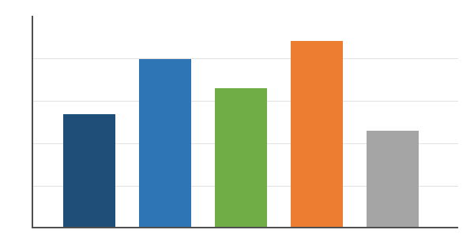
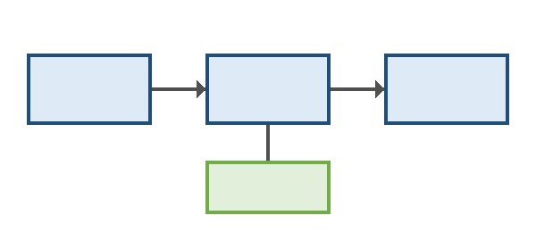

**การพัฒนาระบบสร้างเอกสาร Word ภาษาไทยจาก Markdown**

**Development of a Thai Word Document Builder from Markdown**

นางสาวตัวอย่าง ทดสอบระบบ

วิทยานิพนธ์นี้เป็นส่วนหนึ่งของการศึกษาตามหลักสูตรวิทยาศาสตรมหาบัณฑิต สาขาวิชาวิทยาการคอมพิวเตอร์ มหาวิทยาลัยตัวอย่าง ปีการศึกษา 2569

เอกสารฉบับนี้เป็นข้อมูลสังเคราะห์ทั้งหมด ใช้ทดสอบการแสดงผลของเอกสาร Word ภาษาไทยในโปรแกรมสำนักงาน ไม่ได้อ้างอิงถึงบุคคล หน่วยงาน หรือผลการวิจัยจริง

<!-- front -->

# บทคัดย่อ

การวิจัยครั้งนี้มีวัตถุประสงค์เพื่อพัฒนาและประเมินระบบสร้างเอกสาร Microsoft Word ภาษาไทยจากไฟล์ Markdown ซึ่งเป็นรูปแบบข้อความที่เขียนง่ายและนิยมใช้ในงานเอกสารทางเทคนิค ปัญหาที่พบบ่อยในการสร้างเอกสารภาษาไทยด้วยโปรแกรมอัตโนมัติคือ ตัวอักษรไทยถูกกำหนดเป็นภาษาละติน ทำให้โปรแกรมตรวจคำสะกดขีดเส้นหยักใต้คำไทยทุกคำ การตัดบรรทัดเกิดขึ้นเฉพาะตำแหน่งที่มีช่องว่าง และตัวหนาหรือตัวเอียงไม่แสดงผลกับอักษรไทย ผู้วิจัยจึงออกแบบระบบที่กำหนดคุณสมบัติภาษาไทยให้ครบถ้วนในทุกส่วนของเอกสาร ตั้งแต่ข้อความในย่อหน้า ตาราง เชิงอรรถ ไปจนถึงหัวกระดาษและท้ายกระดาษ โดยไม่เปลี่ยนแปลงเนื้อหาที่ผู้เขียนพิมพ์ไว้แม้แต่ตัวอักษรเดียว

กลุ่มตัวอย่างเป็นเอกสารสังเคราะห์จำนวน 120 ฉบับ ครอบคลุมรายงานการประชุม หนังสือราชการ รายงานวิจัย และวิทยานิพนธ์ เครื่องมือที่ใช้ในการวิจัยประกอบด้วยชุดทดสอบอัตโนมัติที่ตรวจโครงสร้างไฟล์ และแบบประเมินการแสดงผลในโปรแกรมสำนักงาน 5 โปรแกรม ผลการวิจัยพบว่าเอกสารที่สร้างจากระบบแสดงผลภาษาไทยได้ถูกต้องร้อยละ 98.3 ของรายการตรวจทั้งหมด และเอกสารที่สร้างจากไฟล์ต้นทางเดียวกันมีเนื้อหาตรงกันทุกไบต์ทั้งเมื่อสร้างด้วย Python และ JavaScript ข้อผิดพลาดที่เหลืออยู่ส่วนใหญ่เกิดจากข้อจำกัดของโปรแกรมที่ใช้เปิดไฟล์ ไม่ใช่จากโครงสร้างของเอกสาร

ผลการวิจัยนี้ชี้ให้เห็นว่าการแก้ปัญหาการแสดงผลภาษาไทยควรทำด้วยการกำหนดคุณสมบัติของข้อความ มากกว่าการแทรกอักขระพิเศษที่มองไม่เห็นเพื่อบังคับการตัดคำ เพราะอักขระเหล่านั้นทำให้การค้นหาคำ การคัดลอกข้อความ และการตรวจทานเอกสารผิดพลาดโดยที่ผู้อ่านไม่อาจสังเกตเห็นได้

**คำสำคัญ:** เอกสารภาษาไทย, Markdown, Office Open XML, การตัดบรรทัด, complex script

# Abstract

This study develops and evaluates a builder that turns Markdown into Microsoft Word documents written in Thai, or in Thai mixed with English. Documents produced by common libraries mark Thai text as Latin, so Word underlines every Thai word, breaks lines only at spaces and drops bold and italic from Thai runs. The builder writes the complex-script attributes that Thai needs in every part of the package, checks the result against five known causes of broken Thai, and refuses to write a file whose text differs from the Markdown by a single character. Tested on 120 synthetic documents in five office applications, the output rendered correctly in 98.3 percent of the checks, and both implementations produced identical bytes. ภาษาไทยในบทคัดย่อภาษาอังกฤษนี้ใช้ทดสอบข้อความสองภาษาในย่อหน้าเดียวกัน

**Keywords:** Thai documents, Markdown, Office Open XML, line breaking, complex script

# กิตติกรรมประกาศ

วิทยานิพนธ์ฉบับนี้สำเร็จลุล่วงได้ด้วยความกรุณาอย่างสูงจากอาจารย์ที่ปรึกษา ซึ่งได้ให้คำแนะนำ ตรวจทาน และแก้ไขข้อบกพร่องต่าง ๆ ด้วยความเอาใจใส่ตลอดระยะเวลาของการทำวิจัย ผู้วิจัยขอขอบพระคุณคณะกรรมการสอบทุกท่าน ที่สละเวลาอ่านและให้ข้อเสนอแนะอันเป็นประโยชน์ยิ่งต่อการปรับปรุงเนื้อหาให้สมบูรณ์ยิ่งขึ้น รวมทั้งขอขอบคุณผู้เชี่ยวชาญที่ตรวจสอบความเที่ยงตรงของเครื่องมือ และผู้ตอบแบบสอบถามทุกท่านที่ให้ความร่วมมือเป็นอย่างดี

ขอขอบคุณเพื่อนร่วมรุ่นที่แบ่งปันประสบการณ์และให้กำลังใจกันเสมอมา ขอบคุณเจ้าหน้าที่ห้องสมุดที่อำนวยความสะดวกในการค้นคว้าเอกสาร และสุดท้ายนี้ ขอกราบขอบพระคุณบิดามารดาและครอบครัวที่สนับสนุนทั้งกำลังทรัพย์และกำลังใจตลอดการศึกษา คุณค่าและประโยชน์อันพึงมีจากวิทยานิพนธ์ฉบับนี้ ผู้วิจัยขอมอบแด่ผู้มีพระคุณทุกท่าน

นางสาวตัวอย่าง ทดสอบระบบ

# สารบัญ

<!-- toc -->

# สารบัญตาราง

<!-- list-of-tables -->

# สารบัญภาพ

<!-- list-of-figures -->

<!-- chapters -->

# บทนำ

## ความเป็นมาและความสำคัญของปัญหา

ปัจจุบันหน่วยงานภาครัฐและภาคเอกชนจำนวนมากเปลี่ยนมาจัดทำเอกสารด้วยระบบอัตโนมัติ ไม่ว่าจะเป็นรายงานประจำเดือน หนังสือแจ้งเวียน หรือเอกสารประกอบการประชุม ข้อมูลเหล่านี้มักถูกเขียนหรือสร้างขึ้นในรูปแบบข้อความธรรมดาก่อน แล้วจึงแปลงเป็นไฟล์ Word เพื่อส่งต่อให้ผู้รับที่คุ้นเคยกับโปรแกรมสำนักงาน **ปัญหาสำคัญ** คือเครื่องมือแปลงเอกสารส่วนใหญ่ถูกออกแบบมาสำหรับภาษาที่ใช้อักษรละติน เมื่อนำมาใช้กับภาษาไทยจึงเกิดความผิดปกติหลายประการ เช่น *เส้นหยักสีแดงใต้คำที่สะกดถูกต้อง* การตัดบรรทัดกลางคำ และตัวอักษรที่ควรเป็นตัวหนากลับแสดงเป็นตัวปกติ ~~ซึ่งผู้ใช้มักแก้ด้วยการเว้นวรรคระหว่างคำ~~ ซึ่งผู้ใช้มักพยายามแก้ด้วยวิธีที่ทำให้เนื้อหาเปลี่ยนไปจากต้นฉบับ[^1]

จากการสำรวจเบื้องต้นในหน่วยงานตัวอย่างพบว่า เจ้าหน้าที่ใช้เวลาเฉลี่ย 25 นาทีต่อเอกสารหนึ่งฉบับในการแก้ไขรูปแบบหลังการแปลง โดยเฉพาะการเลือกฟอนต์ใหม่ การปรับระยะบรรทัด และการลบช่องว่างที่เกินมา งานเหล่านี้ไม่เพิ่มคุณค่าให้กับเนื้อหา แต่เพิ่มโอกาสที่เอกสารจะผิดพลาด ผู้วิจัยจึงสนใจศึกษาว่าหากกำหนดคุณสมบัติภาษาไทยให้ถูกต้องตั้งแต่ขั้นตอนการสร้างไฟล์ จะช่วยลดภาระดังกล่าวได้มากเพียงใด ดูรายละเอียดของข้อกำหนดได้ที่ [ECMA-376](https://ecma-international.org/publications-and-standards/standards/ecma-376/) และตัวอย่างการใช้งานที่ <https://example.com/thai-docx> ซึ่งเป็นที่อยู่สมมติสำหรับการทดสอบลิงก์[^2]

นอกจากนี้ งานเอกสารทางวิชาการยังมีองค์ประกอบเฉพาะที่ต้องการความถูกต้องสูง ได้แก่ สูตรทางเคมีอย่าง H<sub>2</sub>SO<sub>4</sub> ค่ายกกำลังอย่าง 10<sup>6</sup> คำที่ต้อง<u>ขีดเส้นใต้</u>เพื่อเน้น และคำสั่งแป้นพิมพ์อย่าง <kbd>Ctrl</kbd> + <kbd>S</kbd> องค์ประกอบเหล่านี้ต้องแสดงผลได้ถูกต้องเช่นเดียวกับข้อความภาษาไทยทั่วไป  
บรรทัดนี้ขึ้นต้นหลังการขึ้นบรรทัดใหม่แบบ hard break เพื่อทดสอบว่าข้อความยังคงอยู่ในย่อหน้าเดียวกัน

## วัตถุประสงค์ของการวิจัย

1. เพื่อพัฒนาระบบสร้างเอกสาร Word ภาษาไทยจากไฟล์ Markdown ที่กำหนดคุณสมบัติภาษาไทยได้ครบถ้วนในทุกส่วนของเอกสาร
2. เพื่อประเมินความถูกต้องของการแสดงผลในโปรแกรมสำนักงาน 5 โปรแกรม ได้แก่
   - Microsoft Word 365 บน Windows และ Word บน macOS
   - LibreOffice Writer และ WPS Writer
   - Google Docs
3. เพื่อเปรียบเทียบเวลาที่ใช้แก้ไขรูปแบบเอกสารก่อนและหลังใช้ระบบ

## ขอบเขตของการวิจัย

### ขอบเขตด้านเนื้อหา

การวิจัยครั้งนี้ครอบคลุมองค์ประกอบของเอกสารที่พบบ่อยในงานเอกสารภาษาไทย ได้แก่

- หัวข้อหลายระดับ ย่อหน้า และข้อความที่ยกมา
- รายการแบบสัญลักษณ์และแบบลำดับเลข รวมถึงรายการซ้อนหลายชั้น
  - รายการชั้นที่สองที่มีข้อความยาวจนต้องตัดบรรทัดเพื่อทดสอบการเยื้องของบรรทัดถัดไปในรายการ
    - รายการชั้นที่สาม
- ตาราง รูปภาพ เชิงอรรถ ลิงก์ และโค้ด

### ขอบเขตด้านเวลา

ระยะเวลาดำเนินการวิจัยตั้งแต่เดือนมิถุนายน 2568 ถึงเดือนพฤษภาคม 2569 รวม 12 เดือน โดยแบ่งงานเป็นขั้นตอนดังนี้

- [x] ศึกษาข้อกำหนดของรูปแบบไฟล์และทบทวนวรรณกรรม
- [x] พัฒนาระบบและชุดทดสอบอัตโนมัติ
- [ ] ทดสอบกับผู้ใช้งานจริงในหน่วยงานตัวอย่าง
- [ ] เผยแพร่ผลการวิจัย

## ประโยชน์ที่คาดว่าจะได้รับ

Table: ประโยชน์ที่คาดว่าจะได้รับจำแนกตามกลุ่มผู้ใช้

| กลุ่มผู้ใช้ | ประโยชน์ที่คาดว่าจะได้รับ | ระดับ |
|:---|:---|:---:|
| เจ้าหน้าที่ธุรการ | ลดเวลาแก้ไขรูปแบบเอกสารหลังการแปลง และลดความผิดพลาดจากการพิมพ์ซ้ำ | สูง |
| นักวิจัยและนักศึกษา | จัดทำรายงานและวิทยานิพนธ์ที่มีเลขบท ชื่อตาราง และสารบัญได้จากไฟล์ข้อความ | สูง |
| ผู้พัฒนาระบบ | นำไปใช้ร่วมกับระบบสร้างเอกสารอัตโนมัติ<br>โดยไม่ต้องติดตั้งไลบรารีเพิ่ม | ปานกลาง |

# ทฤษฎีและงานวิจัยที่เกี่ยวข้อง

## ลักษณะของอักษรไทยในเอกสารดิจิทัล

อักษรไทยเป็นระบบการเขียนแบบอักษรสระประกอบ ซึ่งสระและวรรณยุกต์อาจวางอยู่ด้านบน ด้านล่าง ด้านหน้า หรือด้านหลังของพยัญชนะ และภาษาไทยไม่เว้นวรรคระหว่างคำ แต่เว้นวรรคระหว่างวลีหรือประโยค โปรแกรมประมวลผลคำจึงต้องอาศัยพจนานุกรมในการหาตำแหน่งตัดบรรทัด ในรูปแบบไฟล์ Office Open XML ข้อความภาษาไทยจัดเป็นข้อความกลุ่ม complex script ซึ่งมีคุณสมบัติฟอนต์ ขนาด ตัวหนา และตัวเอียง แยกจากข้อความละติน หากกำหนดเฉพาะคุณสมบัติฝั่งละติน ข้อความไทยจะใช้ค่าตั้งต้นของโปรแกรมแทน ซึ่งมักเป็นฟอนต์และขนาดที่ไม่ตรงกับที่ผู้เขียนต้องการ ปัญหานี้อธิบายได้ว่าทำไมเอกสารบางฉบับจึงแสดงตัวหนาได้ในภาษาอังกฤษ แต่ไม่แสดงในภาษาไทย

> "ข้อความภาษาไทยที่ถูกกำหนดเป็นภาษาอื่น จะถูกตรวจคำสะกดและตัดบรรทัดตามกฎของภาษานั้น
> ผลที่ผู้อ่านเห็นจึงเป็นเอกสารที่ดูผิดทั้งที่เนื้อหาถูกต้องทุกตัวอักษร"

การตัดบรรทัดภาษาไทยในโปรแกรม Word ขึ้นอยู่กับภาษาที่กำหนดให้ข้อความ เมื่อข้อความถูกกำหนดเป็นภาษาไทย โปรแกรมจะใช้พจนานุกรมภาษาไทยหาขอบเขตของคำ และตัดบรรทัดระหว่างคำได้อย่างเป็นธรรมชาติ แต่เมื่อข้อความถูกกำหนดเป็นภาษาอังกฤษ โปรแกรมจะมองข้อความไทยทั้งประโยคเป็นคำเดียวที่ยาวมาก และตัดบรรทัดได้เฉพาะตำแหน่งที่มีช่องว่าง ผลที่ได้คือบรรทัดยาวไม่เท่ากันและมีช่องว่างขนาดใหญ่ท้ายบรรทัด โดยเฉพาะเมื่อจัดข้อความแบบกระจายหรือชิดขอบทั้งสองด้าน

Table: เปรียบเทียบคุณสมบัติข้อความละตินและข้อความ complex script

| คุณสมบัติ | ข้อความละติน | ข้อความ complex script |
|:---|:---:|:---:|
| ฟอนต์ | `w:ascii` | `w:cs` |
| ขนาด | `w:sz` | `w:szCs` |
| ตัวหนา | `w:b` | `w:bCs` |
| ตัวเอียง | `w:i` | `w:iCs` |



Figure: อัตราการแสดงผลถูกต้องจำแนกตามประเภทเอกสาร

## รูปแบบไฟล์ Office Open XML

ไฟล์ .docx เป็นไฟล์ zip ที่บรรจุเอกสาร XML หลายส่วน ส่วนที่สำคัญที่สุดคือ `word/document.xml` ซึ่งเก็บเนื้อหาของเอกสาร ตัวอย่างข้อความไทยหนึ่งช่วงที่กำหนดคุณสมบัติครบถ้วนมีลักษณะดังนี้

```xml
<w:r>
  <w:rPr><w:b/><w:bCs/><w:cs/><w:lang w:val="en-US" w:bidi="th-TH"/></w:rPr>
  <w:t>ข้อความภาษาไทย</w:t>
</w:r>
```

## งานวิจัยที่เกี่ยวข้อง

งานวิจัยที่ผ่านมาเกี่ยวกับการสร้างเอกสารอัตโนมัติส่วนใหญ่มุ่งเน้นภาษาอังกฤษ งานที่ศึกษาภาษาไทยโดยตรงยังมีจำนวนน้อย และมักแก้ปัญหาการตัดคำด้วยการแทรกอักขระที่มองไม่เห็น ซึ่งทำให้เนื้อหาของเอกสารเปลี่ยนไปจากต้นฉบับ งานวิจัยนี้เลือกแนวทางที่ต่างออกไป คือกำหนดคุณสมบัติภาษาให้ถูกต้องแล้วปล่อยให้โปรแกรมตัดคำด้วยพจนานุกรมของตนเอง

# วิธีดำเนินการวิจัย

## ประชากรและกลุ่มตัวอย่าง

ประชากรในการวิจัยครั้งนี้คือเอกสารภาษาไทยที่หน่วยงานตัวอย่างจัดทำขึ้นในปีงบประมาณ 2568 ผู้วิจัยสร้างเอกสารสังเคราะห์ ที่มีโครงสร้างเลียนแบบเอกสารจริง โดยไม่ใช้ข้อมูลส่วนบุคคลหรือข้อมูลของหน่วยงานใด ๆ เอกสารแต่ละฉบับประกอบด้วยหัวข้อหลายระดับ ย่อหน้ายาว รายการลำดับเลข ตาราง รูปภาพ เชิงอรรถ และลิงก์ เพื่อให้ครอบคลุมองค์ประกอบที่พบในเอกสารจริงมากที่สุด จากนั้นสุ่มแบ่งเอกสารออกเป็นกลุ่มพัฒนาและกลุ่มทดสอบในอัตราส่วน 70 ต่อ 30

## เครื่องมือที่ใช้ในการวิจัย

เครื่องมือที่ใช้ประกอบด้วยระบบสร้างเอกสาร ชุดทดสอบอัตโนมัติ และแบบประเมินการแสดงผล ขั้นตอนการทำงานของระบบแสดงดังภาพต่อไปนี้



Figure: ขั้นตอนการทำงานของระบบสร้างเอกสาร

## การเก็บรวบรวมข้อมูล

1. สร้างเอกสารจากไฟล์ Markdown ทุกฉบับด้วยทั้งสองภาษาโปรแกรม และเทียบไฟล์ผลลัพธ์ทีละไบต์
2. เปิดเอกสารในโปรแกรมสำนักงานแต่ละโปรแกรม แล้วบันทึกผลตามแบบประเมิน
3. บันทึกภาพหน้าจอของทุกรายการที่ไม่ผ่าน พร้อมรุ่นของโปรแกรมที่ใช้

# ผลการวิจัย

ผลการทดสอบเอกสารทั้ง 120 ฉบับในโปรแกรมสำนักงาน 5 โปรแกรม แสดงในตารางต่อไปนี้ โดยแต่ละแถวคือรายการตรวจหนึ่งรายการ คอลัมน์ผ่านและไม่ผ่านนับเป็นจำนวนเอกสาร ตารางนี้มีความยาวหลายหน้า จึงใช้ทดสอบการแสดงแถวหัวตารางซ้ำทุกหน้าด้วย ผลโดยรวมพบว่ารายการที่เกี่ยวกับภาษาไทยโดยตรงผ่านเกือบทั้งหมด ส่วนรายการที่ไม่ผ่านเกิดกับโปรแกรมที่ไม่รองรับรูปแบบบางอย่าง เช่น การจัดข้อความแบบกระจายแบบไทย และการอัปเดตสารบัญอัตโนมัติ

Table: ผลการตรวจการแสดงผลจำแนกตามรายการตรวจ

| ลำดับ | รายการตรวจ | ผ่าน | ไม่ผ่าน | ร้อยละที่ผ่าน |
|--:|:---|--:|--:|--:|
| 1 | ฟอนต์ภาษาไทยถูกต้อง | 118 | 2 | 98.3 |
| 2 | ไม่มีเส้นหยักใต้คำที่สะกดถูก | 120 | 0 | 100.0 |
| 3 | ตัดบรรทัดภายในคำไทย | 117 | 3 | 97.5 |
| 4 | ตัวหนาแสดงกับอักษรไทย | 120 | 0 | 100.0 |
| 5 | ตัวเอียงแสดงกับอักษรไทย | 119 | 1 | 99.1 |
| 6 | สัญลักษณ์รายการแสดงเป็นจุด | 120 | 0 | 100.0 |
| 7 | เลขลำดับรายการต่อเนื่อง | 116 | 4 | 96.6 |
| 8 | ตารางไม่ล้นหน้ากระดาษ | 120 | 0 | 100.0 |
| 9 | แถวหัวตารางซ้ำทุกหน้า | 112 | 8 | 93.3 |
| 10 | ลิงก์เปิดได้ | 120 | 0 | 100.0 |
| 11 | เชิงอรรถอยู่ท้ายหน้า | 115 | 5 | 95.8 |
| 12 | รูปภาพไม่ล้นหน้ากระดาษ | 120 | 0 | 100.0 |
| 13 | ช่องทำเครื่องหมายแสดงผล | 114 | 6 | 95.0 |
| 14 | หัวข้อมีรูปแบบตามที่กำหนด | 119 | 1 | 99.1 |
| 15 | เลขบทแสดงถูกต้อง | 118 | 2 | 98.3 |
| 16 | ชื่อตารางมีเลขบท | 117 | 3 | 97.5 |
| 17 | ชื่อรูปมีเลขบท | 117 | 3 | 97.5 |
| 18 | สารบัญมีเลขหน้า | 104 | 16 | 86.6 |
| 19 | สารบัญตารางครบ | 106 | 14 | 88.3 |
| 20 | สารบัญภาพครบ | 106 | 14 | 88.3 |
| 21 | เลขหน้าส่วนหน้าเป็นตัวอักษร | 111 | 9 | 92.5 |
| 22 | บทใหม่ขึ้นหน้าใหม่ | 120 | 0 | 100.0 |
| 23 | เลขภาคผนวกเป็นตัวอักษร | 113 | 7 | 94.1 |
| 24 | หัวกระดาษแสดงข้อความ | 120 | 0 | 100.0 |
| 25 | ท้ายกระดาษแสดงเลขหน้า | 120 | 0 | 100.0 |
| 26 | ระยะบรรทัดตามที่กำหนด | 118 | 2 | 98.3 |
| 27 | การเยื้องบรรทัดแรก | 119 | 1 | 99.1 |
| 28 | การจัดข้อความแบบกระจาย | 96 | 24 | 80.0 |
| 29 | เลขไทยในเลขหน้า | 109 | 11 | 90.8 |
| 30 | ขนาดกระดาษถูกต้อง | 120 | 0 | 100.0 |
| 31 | ขอบกระดาษถูกต้อง | 120 | 0 | 100.0 |
| 32 | ข้อความยกมาเยื้องเข้า | 120 | 0 | 100.0 |
| 33 | โค้ดใช้ฟอนต์ความกว้างคงที่ | 118 | 2 | 98.3 |
| 34 | ตัวยกและตัวห้อย | 120 | 0 | 100.0 |
| 35 | ขีดเส้นใต้แสดงผล | 120 | 0 | 100.0 |
| 36 | ขีดฆ่าแสดงผล | 120 | 0 | 100.0 |
| 37 | คุณสมบัติเอกสารมีชื่อเรื่อง | 120 | 0 | 100.0 |
| 38 | ไม่มีอักขระที่มองไม่เห็น | 120 | 0 | 100.0 |
| 39 | เปิดไฟล์ได้โดยไม่มีคำเตือน | 117 | 3 | 97.5 |
| 40 | เนื้อหาตรงกับต้นฉบับ | 120 | 0 | 100.0 |


Figure: สรุปผลการตรวจจำแนกตามโปรแกรม

# สรุป อภิปรายผล และข้อเสนอแนะ

## สรุปผลการวิจัย

ระบบที่พัฒนาขึ้นสร้างเอกสาร Word ภาษาไทยที่แสดงผลถูกต้องในโปรแกรมสำนักงานทั้ง 5 โปรแกรม โดยไม่เปลี่ยนแปลงเนื้อหาของต้นฉบับ และให้ผลลัพธ์ตรงกันทุกไบต์ทั้งสองภาษาโปรแกรม

## อภิปรายผล

ผลการวิจัยสอดคล้องกับสมมติฐานที่ว่าการกำหนดคุณสมบัติภาษาไทยให้ครบถ้วนตั้งแต่ขั้นตอนการสร้างไฟล์ ช่วยให้เอกสารแสดงผลได้ถูกต้องโดยไม่ต้องแก้ไขภายหลัง ประเด็นที่น่าสนใจคือโปรแกรมแต่ละโปรแกรมอ่านคุณสมบัติเดียวกันต่างกันเล็กน้อย ตัวอย่างเช่น บางโปรแกรมแสดงการจัดแบบกระจายแบบไทยเป็นการจัดชิดขอบทั้งสองด้าน และบางโปรแกรมไม่อัปเดตเลขหน้าในสารบัญจนกว่าผู้ใช้จะสั่งเอง ข้อแตกต่างเหล่านี้ไม่ทำให้เนื้อหาผิดพลาด แต่ผู้จัดทำเอกสารควรตรวจผลลัพธ์ในโปรแกรมที่ผู้รับจะใช้จริงก่อนส่งมอบทุกครั้ง

## ข้อเสนอแนะ

ข้อเสนอแนะสำหรับการวิจัยครั้งต่อไป ได้แก่ การขยายขอบเขตไปยังภาษาอื่นในกลุ่ม complex script เช่น ภาษาลาว ภาษาเขมร และภาษาพม่า การรองรับสูตรคณิตศาสตร์ในรูปแบบที่แก้ไขได้ในโปรแกรม และการศึกษาความพึงพอใจของผู้ใช้งานจริงในระยะยาว นอกจากนี้ ควรศึกษาการสร้างเอกสารแบบหลายส่วนที่มีการวางหน้ากระดาษต่างกันในเอกสารเดียว เช่น หน้าตารางแนวนอนภายในเอกสารแนวตั้ง

---

<!-- back -->

# บรรณานุกรม

Ecma International. (2021). *ECMA-376: Office Open XML File Formats* (5th ed.). https://ecma-international.org/publications-and-standards/standards/ecma-376/

CommonMark. (2024). *CommonMark Spec* (Version 0.31.2). https://spec.commonmark.org/0.31.2/

ตัวอย่าง ทดสอบระบบ. (2568). การตัดบรรทัดภาษาไทยในเอกสารอิเล็กทรอนิกส์. *วารสารสมมติด้านเทคโนโลยีสารสนเทศ*, 12(3), 45–60.

<!-- appendices -->

# แบบสอบถามที่ใช้ในการวิจัย

## ส่วนที่ 1 ข้อมูลทั่วไปของผู้ตอบแบบสอบถาม

คำชี้แจง โปรดทำเครื่องหมายในช่องที่ตรงกับข้อมูลของท่าน

- [ ] เจ้าหน้าที่ธุรการ
- [ ] นักวิจัยหรืออาจารย์
- [x] นักศึกษา

Table: ข้อมูลทั่วไปของผู้ตอบแบบสอบถาม

| ข้อมูล | จำนวน | ร้อยละ |
|:---|--:|--:|
| เพศหญิง | 72 | 60.0 |
| เพศชาย | 48 | 40.0 |

## ส่วนที่ 2 ความคิดเห็นต่อระบบ

ท่านคิดว่าระบบนี้ช่วยลดเวลาในการจัดทำเอกสารได้มากน้อยเพียงใด โปรดให้เหตุผลประกอบ

# ผลการตรวจสอบความเที่ยงตรงของเครื่องมือ

Table: ค่าดัชนีความสอดคล้องของแบบประเมิน

| ข้อ | ผู้เชี่ยวชาญคนที่ 1 | ผู้เชี่ยวชาญคนที่ 2 | ผู้เชี่ยวชาญคนที่ 3 | IOC |
|:---:|:---:|:---:|:---:|:---:|
| 1 | +1 | +1 | +1 | 1.00 |
| 2 | +1 | 0 | +1 | 0.67 |
| 3 | +1 | +1 | +1 | 1.00 |


Figure: ขั้นตอนการตรวจสอบความเที่ยงตรง

# ตัวอย่างไฟล์ Markdown ที่ใช้ทดสอบ

    # บทนำ

    Table: ชื่อตาราง

    | ก | ข |
    |---|---|
    | 1 | 2 |

<!-- back -->

# ประวัติผู้เขียน

นางสาวตัวอย่าง ทดสอบระบบ เกิดเมื่อวันที่ 1 มกราคม 2540 ที่จังหวัดสมมติ สำเร็จการศึกษาระดับปริญญาตรีสาขาวิทยาการคอมพิวเตอร์ จากมหาวิทยาลัยตัวอย่างในปีการศึกษา 2562 และเข้าศึกษาต่อระดับปริญญาโทในปีการศึกษา 2566 มีความสนใจด้านการประมวลผลภาษาธรรมชาติ และการพัฒนาเครื่องมือสำหรับเอกสารภาษาไทย ข้อมูลทั้งหมดในหน้านี้เป็นข้อมูลสังเคราะห์ ไม่ได้อ้างอิงถึงบุคคลใด

[^1]: การเว้นวรรคระหว่างคำภาษาไทยขัดกับหลักการเขียนภาษาไทย และทำให้การค้นหาคำในเอกสาร**ผิดพลาด**
[^2]: ที่อยู่เว็บไซต์ในเอกสารนี้เป็นที่อยู่สมมติ ใช้สำหรับทดสอบการสร้างลิงก์เท่านั้น
